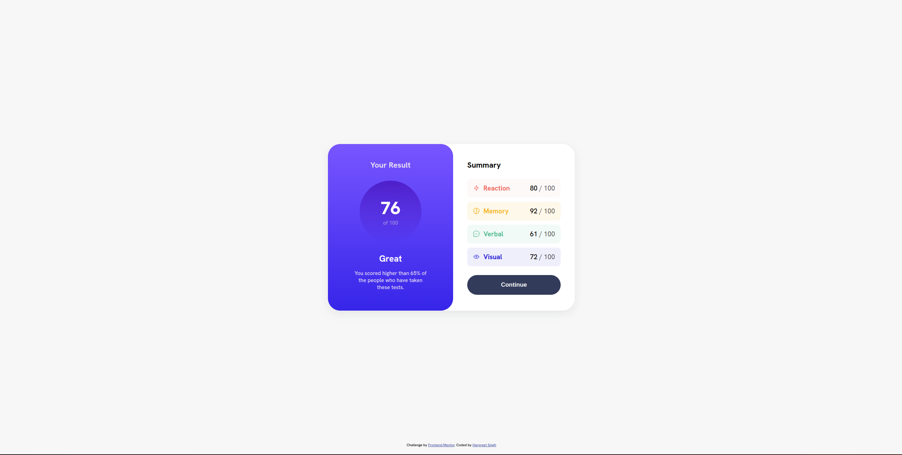

# Frontend Mentor - Results summary component solution

This is a solution to the [Results summary component challenge on Frontend Mentor](https://www.frontendmentor.io/challenges/results-summary-component-CE_K6s0maV). Frontend Mentor challenges help you improve your coding skills by building realistic projects.

## Table of contents

- [Overview](#overview)
  - [The challenge](#the-challenge)
  - [Screenshot](#screenshot)
  - [Links](#links)
  - [Built with](#built-with)

## Overview

### The challenge

Users should be able to:

- View the optimal layout for the interface depending on their device's screen size
- See hover and focus states for all interactive elements on the page
- **Bonus**: Use the local JSON data to dynamically populate the content

### Screenshot

### Links

- Solution URL: [Results summary component solution](https://www.frontendmentor.io/solutions/results-summary-component-using-html-css-and-javascript-rNKW0lp8BG)
- Live Site URL: [Results summary component live](https://harpreet-singh-147.github.io/frontend-mentor-results-component/)

### Built with

- Semantic HTML5 markup
- CSS
- Flexbox
- CSS Grid
- JavaScript

- Frontend Mentor - [@harpreet-singh-147](https://www.frontendmentor.io/profile/harpreet-singh-147)
- Twitter - [@D147Harpreet](https://twitter.com/D147Harpreet)
